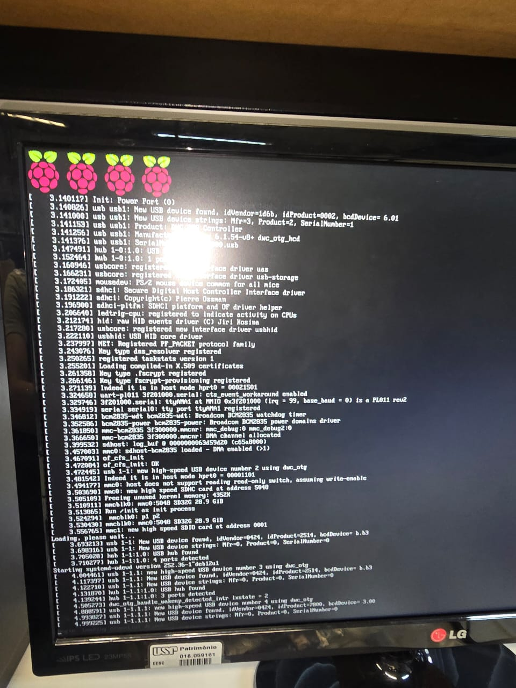

# Prática 5 - Lab de Sistemas Embarcados

nomes: 

        Antônio César de Souza Rocha - 13695383
        Arthur Ribeiro Prager - 14559757
        Gustavo Franzin Campanha - 12717700

A ideia do projeto é fazer inicializar o programa blink.py (que pisca o LED), juntamente com a inicialização do sistema

